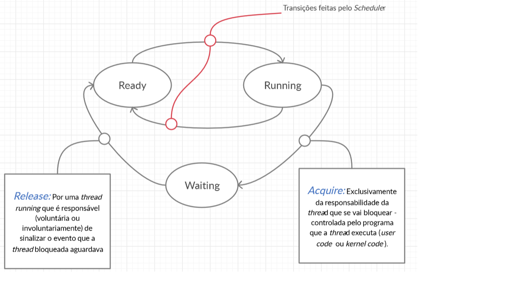

# Revisões
## Conceitos
- ### Imagem Executável
- ### Processo
- ### _Thread_

## Imagem Executável

> Ficheiro com a descrição de um programa.

### Conteúdo de uma imagem executável
- Instruções
- Dados iniciados
- Dimensão dos dados não iniciados
- _Entry point_

## Processo

> Contentor onde decorre a execução de um programa, nomeadamente definido o espaço de endereçamento virtual (tabela de _handles_)

## _Thread_

> Processador virtual (contexto de execução: Registos internos programaticamente acessíveis e pela zona ativa do _kernel_)

### Conteúdo de uma _Thread_

- Contexto de execução
    - Registos
    - _Stack_
- Estados de execução
    - _Ready_ 
    - _Running_
    - _Blocked_/_Waiting_

## Criação de um processo
> (Input: Imagem Executável)

1. Criar o espaço de endereçamento virtual do processo (_VADs_, _page tabels_, ...)
2. Iniciar o EEV com a informação contida na imagem executável (mapear a zona de código e dados iniciados nas respetivas sessões do ficheiro executável e os dados não iniciados em páginas iniciadas com zero).
3. Criar uma _thread_ (_thread_ primária) que inicia a execução do programa no respetivo _entry point_ (feito nomeadamente através de vários trampolins).

## Diagrama de transição entre estados de execução de _Threads_

## _Scheduler_
> Atribuir os processadores lógicos disponíveis às _threads_ no estado _ready_ de acordo com a política de _scheduling_ (respeitando restrições na afinidade dos processadores a _threads_).

### Política de _Scheduling_ mais comuns (Windows,Unix)

- Preemptive Priority Based
